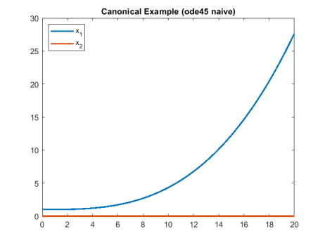
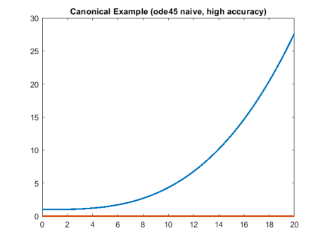
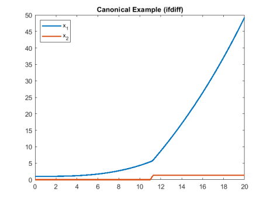
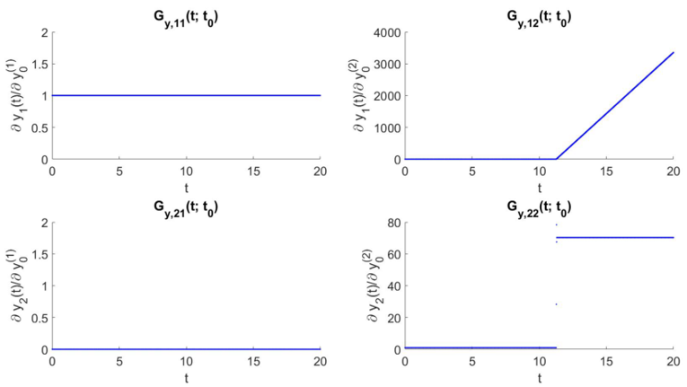
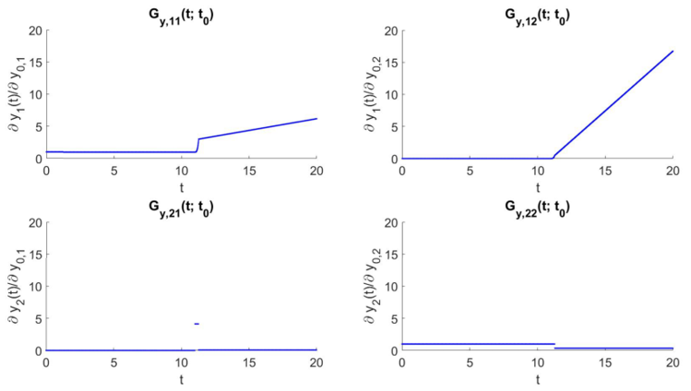

# Workshop: Thursday, July 09, 2026
## Filippov-ODEs and DAEs with State-dependent Switches

**Theory and Hands-On Practical with IFDIFF**

**Thursday, July 09, 2026**

Time: 9–16h • CIP Pool 1 & 2 • 3rd Floor • Mathematikon
Im Neuenheimer Feld 205 • 69120 Heidelberg • and **Online**

Participation is free. Register here: https://t1p.de/ifdiff2026


## Short Course Program

09:00 – 11:00 · Introduction to Switched ODEs

11:00 – 12:00 · Hands-On Practical: Part 1

12:00 – 13:00 · Lunch break (finger food and beverages)

13:00 – 16:00 · Hands-On Practical: Part 2

*Coffee and cookies always available!*

# IFDIFF - A MATLAB Toolkit for ODEs with State˗Dependent Switches


The software package **IFDIFF** provides tools for the accurate numerical solution and sensitivity analysis of ordinary differential equations (ODEs) with state-dependent (implicit) non-differentiabilities ("switches") in the right-hand side as well as Filippov Sliding mode and ODEs with state-jumps.

The right-hand side is supplied as standard MATLAB program code and may contain non-differentiable operators such as `min`, `max`, `abs`, `sign` or `if`-branching. 
IFDIFF automatically detects and processes these switches, generates only the necessary switching functions (exported as MATLAB code), and determines switching points accurately up to machine precision.

IFDIFF handles multidimensional state and parameter vectors and produces solution structures compatible with MATLAB's built-in ODE solvers, allowing transparent use of functions such as `deval` without modification of existing code. 
A single preparation call is sufficient to enable switching-aware integration.

# Canonical Example
Consider the following "canonical example" for a switched ODE system:

$${
   \dot x = f(t,x,p) = \binom{f_1(t,x,p)}{f_2(t,x,p)}
}$$

with

$${
  f_1(t,x,p) = 0.01 \cdot t^2 + x_2^3
  \qquad
  f_2(t,x,p) = \begin{cases} 0 ~~~if~~ x_1 < p  \\  5 ~~~if~~ p \leq x_1 < p+0.5  \\  0 ~~~if~~ x_1 \geq p+0.5  \end{cases}
}$$

and with initial value ${ x(0) = (1,0)^T }$, parameter ${ p = 5.437 }$, over time span ${ t \in [0,20] }$.

This switched ODE system translates straightforward into the following matlab program:

```matlab
function dx = canonicalExampleRHS(t,x,p)
   dx = zeros(2,1);
   dx(1) = 0.01 * t.^2  +  x(2).^3;
   if x(1) < p(1) 
      dx(2) = 0;
   else
      if x(1) < p(1) + 0.5
         dx(2) = 5;
      else
         dx(2) = 0;
      end
   end
end
```

By looking at the equations (or the code), it is obvious that the first compoment is strictly increasing,
and there should be a "kink" in the second component once the first component reaches the threshold value `p`,
and a second "kink" once the first component reaches `p+0.5`.

Let's see what happens if we do not consider appropriate switching handling. 

# Naive Integration with ode45 fails unnoticed

We initialize the variables and start the integration using MATLAB's default integrator `ode45` (explicit Runge-Kutta 4(5)-solver),
without caring for the non-differentiable `if` statements.

```matlab
tspan = [0 20];             % time horizon
x0    = [1;0];              % initial values
p     = 5.437;              % parameter values
solX  = ode45(@(t,x) canonicalExampleRHS(t,x,p), tspan, x0)
T = 0:0.1:20; X = deval(solX2,T); plot(T,X); legend('x_1','x_2');
```


Contrary to wide-spread beliefs, tightening the integration tolerances is not a remedy!
```matlab
odeopts = odeset('AbsTol', 1e-20, 'RelTol', 1e-14);
solX2   = ode45(@(t,x) canonicalExampleRHS(t,x,p), tspan, x0)
```


Without any warning or error, the __naive approach with tight tolerances leads to the same (wrong) result__. Again, no kinks visible. 

# Reliable integration with IFDIFF

With the switching point detection in IFDIFF, after a single call to a preparation routine, 
integration is just as simple as before:
```matlab
initIFDIFF();                                             % initialise IFDIFF (only once)
tspan = [0 20]; x0 = [1;0]; p = 5.437;                    % set time horizon, initial value, parameter
integrator = @ode45;                                      % choose integrator
odeoptions = odeset('AbsTol', 1e-5, 'RelTol', 1e-3);      % set integrator options, here: low accuracy

datahandle = prepareDatahandleForIntegration('canonicalExampleRHS', ...
                                             'integrator', integrator, ...
                                             'options', odeoptions);
sol = solveODE(datahandle, tspan, x0, p); 
T = 0:0.1:20; X = deval(solX2,T); plot(T,X); legend('x_1','x_2');
```
and __IFDIFF delivers the correct result__:  


The switching times can be determined analytically for this example, and the switching times computed by ifdiff
are exact up to integration tolerance. Using, e.g., absolute and relative tolerances of $10^{-14}$ and $10^{-12}$, the
first switching times is computed an error less than $10^{-14}$, and the second with an error less than $10^{-11}$.

Note that the `sol` structure returned by `solveODE` is an augmented version of the solution structures returned
by  MATLAB's very own integrators (see [MATLAB documentation](https://de.mathworks.com/help/matlab/ref/deval.html#bu7iw_j-sol)), 
and can thus be evaluated  using `deval`. That means, IFDIFF can be used transparently within existing code!

## Remarks

While in some cases forcing a small integration step size (for example by using `odeset('MaxStep',1e-2)` in the example above) may produce a visually plausible solution, this approach is not a reliable remedy.

Firstly, restricting the maximum step size contradicts the fundamental idea of adaptive step-size integrators. It globally limits the step size, even in regions where no switching occurs. 
In the example above, choosing a parameter value of `p = 100` would eliminate all switches within the integration horizon, yet the step size would still be unnecessarily constrained.

Secondly, when non-differentiabilities are ignored, there is no principled way to choose an appropriate maximum step size. The integrator provides neither warnings nor error estimates indicating that switching events have been missed.

Thirdly, and as demonstrated in the following section, this approach completely fails to produce meaningful sensitivities.

# Sensitivity Generation

Correct state and parameter sensitivities are crucial for derivative-based optimization and control.
While restricting the maximum integrator step size (e.g. to `0.1`) may allow the naive approach to reproduce the forward trajectory, the resulting sensitivities are completely unreliable and generally unusable.

IFDIFF currently supports first-order forward sensitivities w.r.t. both the initial state and model parameters. Sensitivities can be computed using either external numerical differentiation or variational differential equations:

- **Variational Differential Equations** (`VDE`)
This method typically provides the highest accuracy, as it computes error-controlled sensitivities alongside the forward solution. The variational equations are integrated on each interval between switching events, with appropriate updates applied at the detected switching points to ensure consistency with the forward trajectory.
The required derivatives of the right-hand side are approximated using automated finite differencing.
Due to the augmented system size, this method may become computationally expensive for large-scale problems.

- **External Numerical Differentiation, Piecewise** (`END_piecewise`)
In this approach, sensitivities are computed via finite differencing on each interval between switching events and then connected using the same update rules as in the VDE method.
Although this requires multiple forward integrations per interval, it can be more efficient than VDE for larger systems while still providing accurate sensitivities.

- **External Numerical Differentiation, Full Horizon** (`END_full`) **NOT Recommended**
Here, finite differencing is applied to multiple full-horizon solutions, each computed with switching point detection. Since sensitivities are not propagated across switching points, no intermediate updates are required.
This method is generally not accurate and we do not recommend it, but may be faster for a certain class of problems.
 
## Example sensitivity generation for the Canonical Example

1. Choose step sizes for finite differencing (also used in method `VDE` for generating state derivatives of the rhs). 

    ```matlab
    dim_y  = size(sol.y,1);                
     dim_p  = length(parameters);
     FDstep = generateFDstep(dim_y,dim_p);
    ```

   The `generateDFstep` function accepts several options influencing e.g. step length. 
   See the documentation below for more information.


2. Build the sensitivity function. In this example, the `END_piecewise` method is chosen.

    ```matlab
    sensitivity_function = generateSensitivityFunction(datahandle, sol, FDstep, 'method', 'END_piecewise'); 
    ```
3. Evaluate the sensitivity function at specific times. 

    ```matlab
    t = 0:0.1:20;
    sensitivities = sensitivity_function(t);
    ```

The following picture shows the trajectories of the state sensitivities for the example aboves, $G_{y,ij}(t,t_0) := \frac{d y_i}{d y_{0,j}}(t)$, i.e.
$G_{y,ij}$ denotes the sensitivity of the $i$-th solution component w.r.t. the $j$-th component of the initial value.

| Comparison: Sensitivities w.r.t. initial state                        |                                                                  |
| --------------------------------------------------------------------- | ---------------------------------------------------------------- |
|  |    |
| __Naive approach__: Sensitivities are useless                         | __IFDIFF__: Correct and accurate sensitivities                   |

While IFDIFF produces correct and accurate sensitivities, the sensitivities using the naive approach, again without any warning or hint,
are not only inaccurate (notice the scales!), but plain wrong. 

The following table lists several name-value pairs that can be used to configure `generateSensitivityFunction`

   | Parameters              |   Possible values                                                                   | Defaults                              |
   | ----------------------- | ----------------------------------------------------------------------------------- | ------------------------------------- |
   | calcGy                  | true/false - flag indicating to calculate state sensitivities                       | true                                  |
   | calcGp                  | true/false - flag indicating to calculate parameter sensitivities                   | true                                  |
   | Gmatrices_intermediate  | true/false - flag indicating to store update matrics                                | false                                 |
   | save_intermediates      | true/false - flag indicating to store intermediate calculations                     | true                                  |
   | integrator              | Function handle for ODE solver in MATLAB (e.g. ode45)                               | Integrator used by ifdiff             | 
   | integrator_options      | Options struct generated for ODE solver                                             | Integrator options used by ifdiff     |
   | method                  | String with VDE/END_piecewise/END_full                                              | VDE                                   |
   | directions_y            | Matrix containing directions for directional derivatives w.r.t initial values.      | Identity matrix with dimension n_y    |
   | directions_p            | Matrix containing directions for directional derivatives w.r.t parameters.          | Identity matrix with dimension n_p    |

# IFDIFF is simple to use!

Correct treatment of switched systems requires elaborate formulation of switching functions and tailored integrators, placing high mathematical demands on modelers. 
Even small model changes often imply considerable reformulation effort. Furthermore: ${n}$ switches generate up to ${ 2^n}$ possible program flows and switching functions, rendering a-priori formulations not feasible already in medium-sized models.

IFDIFF programmatically handles switching events, auto-generating only required switching functions. It determines switching times up to machine precision, and ensures accurate simulation and sensitivity results. Transparently extending the Matlab integrators (ode45, ode15s, etc.), IFDIFF is applicable to existing code with state- and parameter-dependent conditionals, thus enabling fast prototyping and relieving modelers of mathematical-technical effort.

Calculation times of the naive approach are a little lower than the ones of IFDIFF. 
But it can generate arbitrarily wrong results without any notice (see the example above!). IFDIFF provides correct integration results, correct first-order sensitivities and information about the switching structure of your model.
