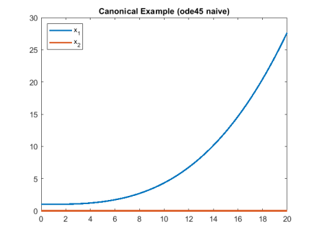

# IFDIFF - A Matlab Toolkit for ODEs with State˗Dependent Switches

The software package IFDIFF deals with the solution and algorithmic generation of sensitivities
in ordinary differential equations with implicit (state-dependent) non-differentiabilites ("switches") 
in the right-hand side that is given as Matlab program code with non-differentiable operators such as 
`min`, `max`, `abs`, `sign`, as well as `if`-branching. IFDIFF automatically generates only necessary 
switching functions, outputs them as Matlab code, and detects switching points accurately up to machine
precision.

IFDIFF handles multidimensional state and parameter vectors and can be transparently used in existing code,
as it generates `sol` solution structures compatible to the Matlab ode solvers. No modifications to the 
right hand side or manual processing are necessary. A single preparation call is sufficient.

In the PErFDiff project, the existing implementation is to be further developed and extended for Filippov systems. 

<br/>
<br/>


# Canonical Example
Consider the following "canonical example" for a switched ODE system:

$$
   \dot x = f(t,x,p) = \binom{f_1(t,x,p)}{f_2(t,x,p)}
$$

with

$$
  f_1(t,x,p) = 0.01 * t^t + x_2^3
  \qquad
  f_2(t,x,p) = \begin{cases} 0 ~~~if~~ x_1 < p  \\  5 ~~~if~~ p \leq x_1 < p+0.5  \\  0 ~~~if~~ x_1 \geq p+0.5  \end{cases}
$$

and with initial value $ x(0) = (1,0)^T $, parameter $ p = 5.437 $, over time span $ t \in [0,20] $.

This switched ODE system translates straightforward into the following matlab program:

```matlab
function dx = canonicalExampleRHS(t,x,p)
   dx = zeros(2,1);
   dx(1) = 0.01 * t.^2  +  x(2).^3;
   if x(1) < p(1) 
      dx(2) = 0;
   else
      if x(1) < p(1) + 0.5
         dx(2) = 5;
      else
         dx(2) = 0;
      end
   end
end
```

By looking at the equations (or the code), it is obvious that the first compoment is strictly increasing,
and there should be a "kink" in the second component once the first component reaches the threshold value `p`,
and a second "kink" once the first component reaches `p+0.5`.

Let's see what happens if we do not consider appropriate switching handling. 

<br/>
<br/>

# Naive Integration with ode45 fails unnoticed

We initialize the variables and start the integration using Matlab's default integrator `ode45` (explicit Runge-Kutta 4(5)-solver),
without caring for the non-differentiable `if` statements.
```matlab
   tspan = [0 20];             % time horizon
   x0    = [1;0];              % initial values
   p     = 5.437;              % parameter values
   solX  = ode45(@(t,x) canonicalExampleRHS(t,x,p), tspan, x0)
   T = 0:0.1:20; X = deval(solX2,T); plot(T,X); legend('x_1','x_2');
```


Contrary to wide-spread beliefs, tightening the integration tolerances is not a remedy!
```matlab
   odeopts = odeset('AbsTol', 1e-20, 'RelTol', 1e-14);
   solX2   = ode45(@(t,x) canonicalExampleRHS(t,x,p), tspan, x0)
```


Without any warning or error, the __naive approach with tight tolerances leads to the same (wrong) result__. Again, no kinks visible. 

<br/>
<br/>

# Reliable integration with IFDIFF

With the switching point detection in IFDIFF, after a single call to a preparation routine, 
integration is just as simple as before:
```matlab
   initPaths();                                              % initialise the paths for ifdiff (only once)
   tspan = [0 20]; x0 = [1;0]; p = 5.437;                    % set time horizon, initial value, parameter
   integrator = @ode45;                                      % choose integrator
   odeoptions = odeset('AbsTol', 1e-5, 'RelTol', 1e-3);      % set integrator options, here: low accuracy
   datahandle = prepareDatahandleForIntegration('canonicalExampleRHS', 'solver', func2str(integrator), 'options', odeoptions);
   sol = solveODE(datahandle, tspan, x0, p); 
   T = 0:0.1:20; X = deval(solX2,T); plot(T,X); legend('x_1','x_2');
```
and __IFDIFF delivers the correct result__:  


The switching times can be determined analytically for this example, and the switching times computed by ifdiff
are exact up to integration tolerance. Using, e.g., absolute and relative toleances of $10^{-14}$ and $10^{-12}$, the
first switching times is computed an error less than $10^{-14}$, and the second with an error less than $10^{-11}$.

Note that the `sol` structure returned by `solveODE` is an augmented version of the solution structures returned
by  Matlab's very own integrators (see https://de.mathworks.com/help/matlab/ref/deval.html#bu7iw_j-sol), 
and can thus be evaluated evalated using `deval`. That means, IFDIFF can be used transparently within existing code!

<br/>

## Remarks

While in many (not all) cases, forcing a small integration step size (e.g. using `odeset('MaxStep',1e-2)` in the above example),
may lead to approximative solutions, this is not a remedy at all. 

First, restricting the maximum step size is completely against the idea of adaptive step size integrators, as it reduces the maximum
step size everywhere - even if there is no switch at all (consider, in the above example, a parameter value of `p=100`; then there is 
no switch in the specified integration horizon).

Second, using the naive approach (i.e. ignoring non-differentiabilities completely), we don't know how to choose ths maximum step size
appropriately, as we don't get any error messages or warnings at all. 

Third, and this we will show in the next section, sensitivites cannot be computed at all by this approach.

<br/>
<br/>

# Computing Sensitivities

Having correct state and parameters sensitivities, i.e. the derivative of the trajectory w.r.t. changes in the initial values or parameters,
is cruicial for derivative-based optimization.  
By restricting the maximum integrator step size to $0.1$, also the naive approach is capable of reproducing the forward trajectory.
However, the sensitivities generated by the naive approach are completely useless.

The following picture shows the trajectories of the state sensitivities, $G_{y,ij}(t,t_0) := \frac{d y_i}{d x_{0,j}}(t)$, i.e.
$G_{y,ij}$ denotes the sensitivity of the $i$-th solution component w.r.t. the $j$-th component of the initial value.

| Comparison: Sensitivities w.r.t. initial state                        |                                                                  |
| --------------------------------------------------------------------- | ---------------------------------------------------------------- |
|  |    |
| __Naive approach__: Sensitivities are useless                         | __IFDIFF__: Correct and accurate sensitivities                   |

<br/>

While IFDIFF produces correct and accurate sensitivities, the sensitivities using the naive approach, again without any warning or hint,
are not only inaccurate (notice the scales!), but plain wrong. 

Details of how to compute sensitivities with IFDIFF are given in the project's [README.md](https://github.com/andreassommer/ifdiff/blob/public/README.md).

<br/>
<br/>

# IFDIFF is not fast - but simple to use

Correct treatment of switched systems requires elaborate formulation of switching functions and tailored integrators, 
placing high mathematical demands on modelers. Even small model changes often imply considerable reformulation effort. 
Furthermore: $n$ switches generate up to $2^n$ possible program flows and switching functions, rendering a-priori 
formulations not feasible already in medium-sized models.

IFDIFF programmatically handles switching events, auto-generating only required switching functions. 
It determines switching times up to machine precision, and ensures accurate simulation and sensitivity results. 
Transparently extending the Matlab integrators (ode45, ode15s, etc.), IFDIFF is applicable to existing code with
state- and parameter-dependent conditionals, thus enabling fast prototyping and relieving modelers of
mathematical-technical effort. 

Calculation times of the naive approach are much lower than the ones of IFDIFF. 
But which result do you prefer: A quick or a correct one? The naive approach can make no statement about accuracy.
Much worse, it can generate arbitrarily wrong results without any notice (see the example above!).
IFDIFF provides correct integration results, correct first-order sensitivities and information 
about the switching structure of your model.

