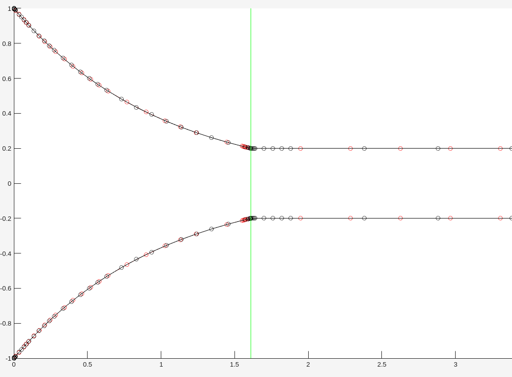
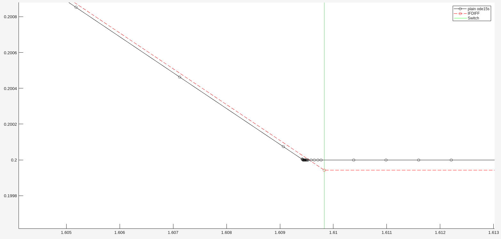

<script
  src="https://cdn.mathjax.org/mathjax/latest/MathJax.js?config=TeX-AMS-MML_HTMLorMML"
  type="text/javascript">
</script>


# Switched DAE Example

## Introduction


A **differential algebraic equation (DAE)** is a system that involves both differential equations and algebraic constraints. These systems may exhibit switching behavior, meaning the system dynamics change depending on certain conditions.
IFDIFF can solve such switched DAEs. 

Let's take a look at the following example for $t \in [0,n]$ where  $n \in \mathbb{N}$:

$$(D) \quad \begin{cases} \dot{x}_ 1 = f_1(x_2) = \begin{cases} x_2, \quad \text{if}  \quad x_2 < p \\ 0 \quad \text{if} \quad x_2 \geq p \end{cases}  \\ f_2(x) = x_1 + x_2 = 0  \\ x_0 = (1,-1)^T, p \in \mathbb{R} \end{cases}$$
 

## Analytical solution

The DAE $(D)$ is of index 1 since the algebraic constraint can be differentiated once to achieve $x_1 + x_2 = 0 \Rightarrow \dot{x_1} + \dot{x_2} = 0 \iff \dot{x_2} = - \dot{x_1}$ which then gives us the ODE system:

$$(D_{\text{ODE}})\begin{cases} \dot{x}_ 1  = f_1(x_2) = \begin{cases} x_2, \quad \text{if} \hspace{0.2cm} x_2 < p\\ 0 \hspace{0.2cm} \text{if} \quad x_2 \geq p \end{cases}  \\ f_2(x) = - \dot{x_1} = \begin{cases} -x_2 \quad \text{if} \quad x_2 < p\\ 0 \quad \text{if} \quad x_2 \geq p \end{cases}   \\ x_0 = (1,-1)^T, p \in \mathbb{R} \end{cases}$$

The system $(D_{\text{ODE}})$ will only exhibit switching behaviour at $p \in (-1,0)$ since:

1. Let $ p \leq -1 $ : 
At $ t = 0 $ we have $x_2(0)= -1 \geq p$. Therefore $\dot{x}_ 2(t)=0$, meaning we stay in the second branch of $f_1$ and no switch occurs.

2. Let $p \geq 0 $ : 
At $ t = 0 $ we have $x_2(0)= -1 < p$.Therefore we only have $\dot{x_2} = - \dot{x_1} \Rightarrow x_1(t) = e^{-t}$ and $x_2(t) = -e^{-t} \hspace{0.2cm} \forall t \in I$. Since $-e^{-t} < 0 \leq p$, not switch occurs in this situation either.

3. So, let $p \in (-1, 0)$:
In this situation the system starts in case 2, so exponential growth in the 1st and exponential decay in the 2nd component.
We now determine the switching point $t_s \in (0,2)$. The switching point satisfies $x_2(t_s)=p$, so $x_2(t_s)=p \iff -e^{-t_s} = p \iff t_s = -\text{ln}(-p) $. (Remember that $-p$ is positive!)

We also notice from the formula $t_s = -\text{ln}(-p)$ that the switching point $t_s$ will be larger as $p$ gets smaller. This means, depending on the parameter, we need to choose a fitting time horizon $[0,n]$

## Solution with IFDIFF

Numerically, an index 1 DAE system is not solved by converting it to an ODE system. Instead, MATLAB offers the solver `ode15s` for solving DAEs which we will use IFDIFF with.

### Step 1: Right Hand Side
We code the Right Hand Side (RHS) as follows.

```
function f = daeExampleRHS(~, x, p)
f = zeros(2,1);

% algebraic constraint
z = x(1) + x(2);
f(2) = z;

% differential variables
if x(2) < p
    f(1) = x(2);
else
    f(1) = 0;
end
```

### Step 2: Setup & Integration
For the main script, we first need to set up the initial value $x_0 = (1,-1)^T$ and a mass matrix $M$ such that the algebraic constant is set to 0 while the differential variables remain as coded in the RHS.
We now need to choose a parameter $ p \in (-1,0) $, e.g. $p = -0.2$ and a suitable time horizon, e.g. $[0,2]$. (You can choose any time horizon large enough to contain the switching point.).
At last for this step, we set up integrator options and the datahandle and then integrate using `solveODE`. To compare our solution with the solution by plain `ode15s`, we can call it with the same options as we set for IFDIFF.

```
integrator = @ode15s;
x0 = [1; -1];
tspan = [0 5];
M = [1 0; 0 0];
p = -0.2;

opts = odeset('Mass', M, 'MassSingular', 'yes', ...
                     'AbsTol', 1e-6, 'RelTol', 1e-3)
datahandle = prepareDatahandleForIntegration('daeExampleRHS', ...
                                             'integrator', integrator, 'options', opts;
sol_ifdiff = solveODE(datahandle, tspan, x0, p);
sol_plain = integrator(@(t, x) daeExampleRHS(t, x, p), tspan, x0, opts_ode);
```

### Step 3: Visualising

To look at our solution and compare them to the plain `ode15s` we can plot both in one plot as follows. Optionally

```
fig1 = figure(01);
hold on
IFDIFF_plot_1 = plot(sol_ifdiff.x, sol_ifdiff.y, 'ro--', 'DisplayName', 'IFDIFF'); 
Plain_plot_1  = plot(sol_plain.x, sol_plain.y, 'ko-', 'DisplayName', 'plain ode15s');
Switch_plot   = xline(sol_ifdiff.switches, 'g', 'LineWidth', 1.0, 'DisplayName', 'Switch');
legend([Plain_plot_1(1), IFDIFF_plot_1(1), Switch_plot]);
hold off
```

This gives us the following plot:



When we take a closer look, we see, that the integration with IFDIFF accurately dedects the switching point. 




## Sensitivities

Analytically, the sensitivities with respect to the parameter $p$ of the DAE $(D)$ are computed by 

$ \frac{d t_s}{d p} = \frac{d}{d p} \left( - \ln (-p) \right) = \frac{1}{p} $

where $t_s$ is the switching point.

Looking at a small initial perturbation $\tilde{x}_ 2(t) = - e^{-t} + \varepsilon x_2(0)$ of $x_2$ for an $\varepsilon > 0$ small enough, we get the perturbation $\tilde{t}_ s$ of the original switching point $t_s$


$ \tilde{x}_ 2(t_s) = - e^{-t_s} + \varepsilon x_2(0) = p \Leftrightarrow \tilde{t}_ s = -\ln(-p - \varepsilon x_2(0)) $

Then we see:

$ \frac{d \tilde{t}_ s}{d x_2(0)} = \frac{d}{d x_2(0)} \left(\ln (-p- \varepsilon x_2(0)) \right) = \frac{1}{-p - \varepsilon x_2(0)} = \frac{1}{p - \varepsilon } $.

To further investigate this example take a look at the files `daeExample_main.m` and `daeExampleRHs.m`
