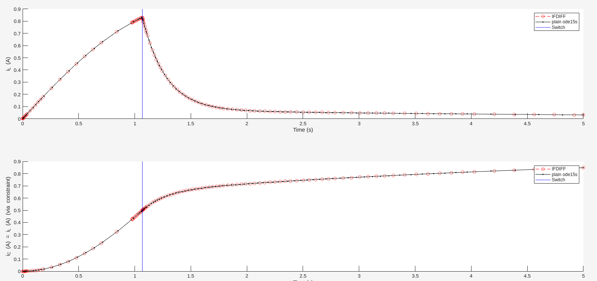
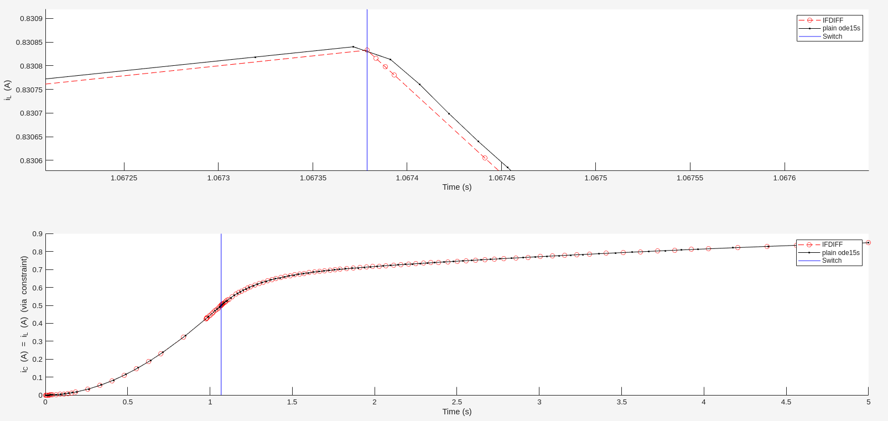

<script
  src="https://cdn.mathjax.org/mathjax/latest/MathJax.js?config=TeX-AMS-MML_HTMLorMML"
  type="text/javascript">
</script>

# RLC Circuit (Voltage-controlled switch)

This example models an **RLC electrical circuit** with a fuse using a differential-algebraic equation (DAE) formulation. 
The system exhibits state-dependent switching between two modes depending on the capacitor voltage $V_C$ relative to a threshold $V_{\text{th}}$.

## Physical Description

The circuit consists of:

- an inductor $L$

- a capacitor $C$

- two possible resistanive elements $R_1$ and $R_2$

- a DC supply voltage $V_s$

When the capacitor voltage exceeds a threshold $V_{\text{th}}$, the circuit switches from high to low resistance.
Such a behavior may be observed​

## Model

The system states are $ x = (i_L, V_C, i_C)^T$. The inductor $L$ follows
Kirchhoff's Voltage Law for the supply $V_s=Ri_L+L\dot{i}_L + V_C $ ($R$ is $R_1$ or $R_2$ depending on the case).
The capacitator $C$ follows the capacitor-current-voltage relation $i_C=C\dot{V}_C$ where $V_C$ is the potential difference between
the capacitor's positive and negative plates.

The algebraic constraint in out model is Kirchhoff's Current Law at the inductor-capacitor node:
Inductor current equals capacitor current since they are in series in the circuit.

With this, the DAE system is given by:

$ (\text D_{\text{RLC}} ) \quad \begin{cases} \dot{i}_L = \begin{cases} \frac{V_s - R_1 i_L - V_C}{L} \quad \text{if}  \quad V_C > V_{\text{th}} \\ \frac{V_s - R_2 i_L - V_C}{L} \quad \text{if} \quad V_C \leq V_{\text{th}} \end{cases} \\ \dot{V}_C = \frac{i_C}{C} \\ i_L−i_C = 0 \end{cases}$

The system is an index 1 DAE since differentiating yields the second-order ODE $L\ddot{i}_L+R\dot{i}L+\frac{1}{C}i_L=0$.


## Solution with IFDIFF

The parameters are stored in a vector `p = [L; R1; R2; C; Vs; Vth]` since we need to keep the input structure `(t,x,p)` for IFDIFF.

```
function dx = rlcRHS(~,x,p)
    dx  = zeros(3,1);
    L   = p(1); R1  = p(2); R2  = p(3);
    C   = p(4); Vs  = p(5); Vth = p(6);
    iL  = x(1); VC  = x(2); iC  = x(3);
    
    % Mode 1: High resistance (fuse intact)
    if VC > Vth
        dx(1) = (Vs - R1*iL - VC)/L;
    else
    % Mode 2: Low resistance (fuse blown)
        dx(1) = (Vs - R2*iL - VC)/L;
    end 
    dx(2) = iC/C;
    dx(3) = iL - iC; % algebraic constraint
end
```

Now, we need to set up a consistent initial value, e.g. $x_0 =(0,0,0)^T$, a suitable time span and a mass matrix $M$ such that the algebraic constraint is set to 0 while the differential variables remain as coded in the RHS above.

```
integrator = @ode15s;
M = diag([1,1,0]);
x0 = [0; 0; 0];
tspan = [0 10];
p = [L; R1; R2; C; Vs; Vth];

opts_ifdiff = odeset('Mass', M,'AbsTol', 1e-8, 'RelTol', 1e-5);
opts_plain  = odeset('Mass', M,'AbsTol', 1e-8, 'RelTol', 1e-5);

datahandle = prepareDatahandleForIntegration('rlcRHS', 'integrator', integrator, 'options', opts_ifdiff);

sol_ifdiff = solveODE(datahandle, tspan, x0, p);
sol_plain  = integrator(@(t, x) rlcRHS(t, x, p), tspan, x0, opts_plain);

```
To compare both solutions, we can plot them and mark the switch.

```
clf;
fig1 = figure(01);

subplot(2,1,1);
hold on;
Plot_ifdiff_1   = plot(sol_ifdiff.x, sol_ifdiff.y(1,:), 'ro--', 'DisplayName', 'IFDIFF'); 
Plot_plain_1    = plot(sol_plain.x, sol_plain.y(1,:), 'k.-', 'DisplayName', 'plain ode15s');
Switch_plot_1   = xline(sol_ifdiff.switches, 'b', 'LineWidth', 1.0, 'DisplayName', 'Switch');
ylabel('i_L (A)');
xlabel('Time (s)');
legend();
hold off;

subplot(2,1,2);
hold on
Plot_ifdiff_2  = plot(sol_ifdiff.x, sol_ifdiff.y(2,:), 'ro--', 'DisplayName', 'IFDIFF' );
Plot_plain_2   =  plot(sol_plain.x, sol_plain.y(2,:), 'k.-', 'DisplayName', 'plain ode15s');
ylabel('i_C (A) = i_L (A) (via constraint)');
Switch_plot_2  = xline(sol_ifdiff.switches, 'b', 'LineWidth', 1.0, 'DisplayName', 'Switch');
xlabel('Time (s)');
legend();
hold off;
```




To further investigate this example, take a look at the files `rlc_main.m` and `rlcRHs.m`.

## Sources

- Physics Foundation: Alexander, C. K., & Sadiku, M. N. O. Fundamentals of Electric Circuits.
- DAE Formulation: Kuzmenko, D. (2018). Switched nonlinear DAEs in electrical circuit theory. Bachelor Thesis, supervised by Prof. Dr. Stephan Trenn.